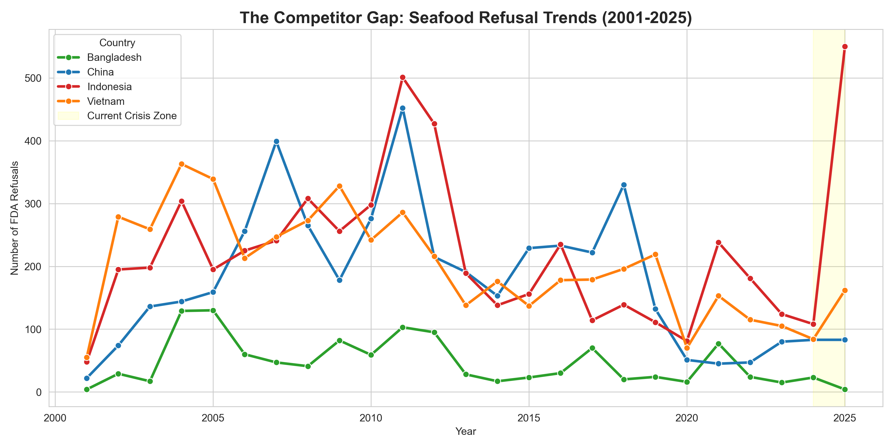
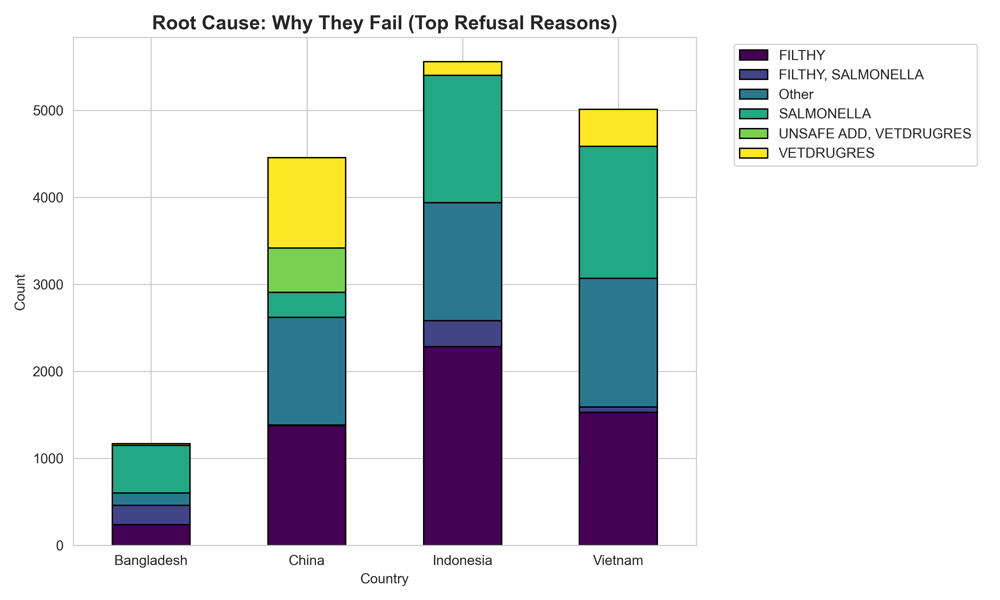

# 🦐 FDA Seafood Supply Chain Risk Analysis (2001–2025)

  

## 🚨 Executive Summary: The $100M "Safety Gap"
**"While Southeast Asia faces a regulatory crisis, a quiet opportunity emerges for South Asia."**

This project analyzes **40,987 records** of U.S. FDA import refusals for fishery/seafood products spanning 25 years. The goal was to identify supply chain vulnerabilities, regulatory "Red Zones," and emerging market gaps.

**Key Finding:** As of late 2025, **Indonesia** and **Vietnam** are experiencing historic spikes in refusals (400% surge) due to sanitary non-compliance ("Filth" & "Salmonella"). In contrast, **Bangladesh** has maintained a stable safety profile, creating an immediate opportunity for compliant suppliers to capture displaced market share.

---

## 📊 Key Insights & Visualizations

### 1. The Competitor Gap (Trend Analysis)
*Tracking the divergence in refusal trends between major exporters.*
* **Insight:** Indonesia (Red Line) hit a vertical spike in 2025, signaling a systemic collapse in quality control. Bangladesh (Green Line) remains stable.

### 2. Root Cause Intelligence
* **Indonesia/Vietnam:** The primary failure mode is **Hygiene** (Filth, Salmonella), indicating issues with ice quality and processing plant sanitation.
* **China:** The primary failure mode is **Chemicals** (Veterinary Drug Residues), indicating issues with aquaculture farming practices (antibiotic overuse).

### 3. The "Hidden Blockade" (DWPE)
* **76% of Indonesian refusals** occurred **without FDA lab analysis**.
* **Implication:** This indicates widespread placement on **Import Alert 16-81** (Detention Without Physical Examination). The FDA has effectively stopped trusting the supply chain.

---

## 🛠️ Technical Methodology

**1. Data Pipeline**
* **Source:** U.S. FDA Import Refusal Report (OASIS Database).
* **Tools:** Python (Pandas for ETL, Seaborn/Matplotlib for Visualization).

**2. Transformation**
* Filtered raw dataset (200k+ rows) to isolate `Product_Category == 'Fishery/Seafood'`.
* Standardized country names and refusal charge codes.
* Performed time-series decomposition to isolate the 2025 anomaly.

---

## 👨‍💻 About the Author
**Md Shafin Ahamed**
*Supply Chain Data Analyst | Food Technology Engineer*
* Specialized in FDA Regulatory Compliance & Trade Analytics.
* Based in **Pabna, Bangladesh** (The heart of the fisheries belt).

---
*Disclaimer: This analysis is based on public FDA data and is intended for research purposes only.*
